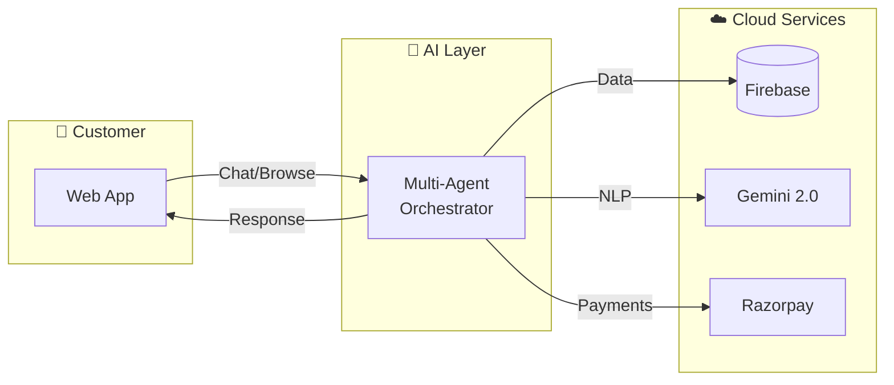
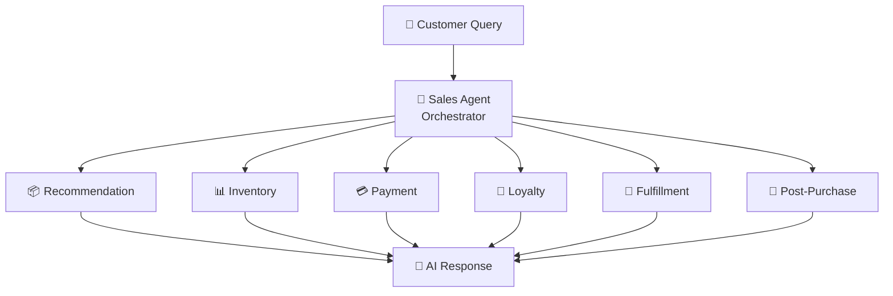
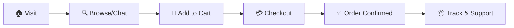
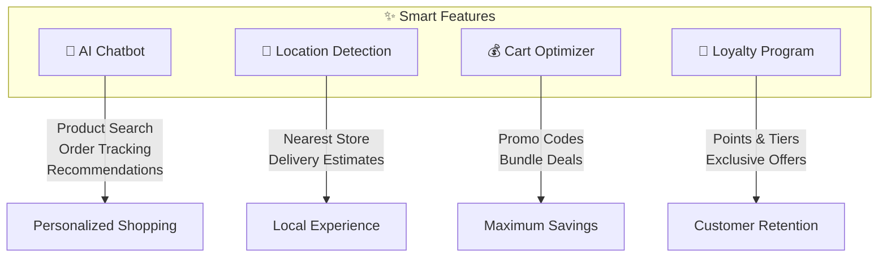
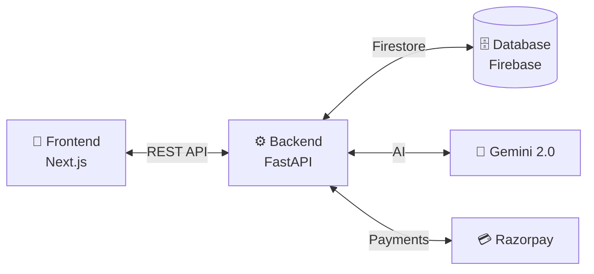

# 🏆 EY Techathon - Retail Sales AI Agent
## Presentation Diagrams

---

# SLIDE 1: System Architecture



**Tech Stack:** Next.js • FastAPI • Google Gemini 2.0 • Firebase • Razorpay

---

# SLIDE 2: AI Agent Architecture



**6 Specialized Agents** powered by Google Gemini 2.0

---

# SLIDE 3: User Journey



**Seamless End-to-End Shopping Experience**

---

# SLIDE 4: Key Features Flow



---

# SLIDE 5: Data Flow



---

# WIREFRAME SLIDES

## SLIDE 6: Main Screens Overview

```
┌─────────────────────────────────────────────────────────────────────────────┐
│                           📱 RETAIL SALES AGENT                             │
├─────────────────┬─────────────────┬─────────────────┬─────────────────────┤
│                 │                 │                 │                     │
│   🏠 HOME       │  🛍️ PRODUCTS    │  🤖 CHATBOT     │  🛒 CART           │
│                 │                 │                 │                     │
│  ┌───────────┐  │  ┌───────────┐  │  ┌───────────┐  │  ┌───────────────┐ │
│  │  Banner   │  │  │ Filters   │  │  │   AI 🤖   │  │  │ Items List    │ │
│  ├───────────┤  │  ├───────────┤  │  │  Message  │  │  ├───────────────┤ │
│  │ Category  │  │  │ Product   │  │  ├───────────┤  │  │ Smart Savings │ │
│  │   Grid    │  │  │   Grid    │  │  │  User 👤  │  │  ├───────────────┤ │
│  ├───────────┤  │  │           │  │  │  Message  │  │  │    Summary    │ │
│  │ Trending  │  │  │           │  │  ├───────────┤  │  ├───────────────┤ │
│  │ Products  │  │  │           │  │  │ [Type...] │  │  │  [Checkout]   │ │
│  └───────────┘  │  └───────────┘  │  └───────────┘  │  └───────────────┘ │
│                 │                 │                 │                     │
└─────────────────┴─────────────────┴─────────────────┴─────────────────────┘
```

---

## SLIDE 7: Chatbot Interface

```
┌───────────────────────────────────────┐
│  🤖 RetailStore AI Assistant          │
├───────────────────────────────────────┤
│                                       │
│  ┌─────────────────────────────────┐  │
│  │ 🤖 Hello! How can I help you?  │  │
│  │    • Find products             │  │
│  │    • Track orders              │  │
│  │    • Get recommendations       │  │
│  └─────────────────────────────────┘  │
│                                       │
│              ┌─────────────────────┐  │
│              │ 👤 Show me TVs     │  │
│              │    under ₹50,000   │  │
│              └─────────────────────┘  │
│                                       │
│  ┌─────────────────────────────────┐  │
│  │ 🤖 Here are top TVs for you:   │  │
│  │    1. Samsung 55" - ₹45,999    │  │
│  │    2. LG 50" - ₹38,999         │  │
│  │    [Add to Cart]               │  │
│  └─────────────────────────────────┘  │
│                                       │
│  [📺 TVs] [👗 Fashion] [📦 Orders]   │
│  ┌─────────────────────────────────┐  │
│  │ Type your message...     [Send] │  │
│  └─────────────────────────────────┘  │
└───────────────────────────────────────┘
```

---

## SLIDE 8: Checkout Flow

```
┌─────────────────────────────────────────────────────────────────┐
│                        💳 CHECKOUT FLOW                         │
├─────────────────────────────────────────────────────────────────┤
│                                                                 │
│    ┌─────────┐     ┌─────────┐     ┌─────────┐     ┌─────────┐ │
│    │   🛒    │     │   📍    │     │   💳    │     │   ✅    │ │
│    │  Cart   │ ──▶ │ Address │ ──▶ │ Payment │ ──▶ │ Confirm │ │
│    │ Review  │     │  Entry  │     │Razorpay │     │  Order  │ │
│    └─────────┘     └─────────┘     └─────────┘     └─────────┘ │
│                                                                 │
│    ✓ Smart Savings    ✓ Auto-fill      ✓ Secure      ✓ Tracking│
│    ✓ Promo Codes      ✓ Location       ✓ UPI/Card    ✓ Points  │
│                                                                 │
└─────────────────────────────────────────────────────────────────┘
```

---

## SLIDE 9: Smart Features

```
┌─────────────────────────────────────────────────────────────────┐
│                     ✨ SMART FEATURES                           │
├─────────────────────────────────────────────────────────────────┤
│                                                                 │
│  ┌──────────────────┐        ┌──────────────────┐              │
│  │ 📍 LOCATION      │        │ 💡 CART OPTIMIZER │              │
│  │                  │        │                  │              │
│  │ Auto-detect city │        │ Smart savings    │              │
│  │ Nearest store    │        │ Promo codes      │              │
│  │ Delivery time    │        │ Loyalty points   │              │
│  └──────────────────┘        └──────────────────┘              │
│                                                                 │
│  ┌──────────────────┐        ┌──────────────────┐              │
│  │ 🤖 AI CHATBOT    │        │ 🎁 LOYALTY       │              │
│  │                  │        │                  │              │
│  │ Natural language │        │ Bronze→Platinum  │              │
│  │ Product search   │        │ Points earning   │              │
│  │ Order tracking   │        │ Exclusive offers │              │
│  └──────────────────┘        └──────────────────┘              │
│                                                                 │
└─────────────────────────────────────────────────────────────────┘
```

---

## SLIDE 10: Complete Solution Overview

```
┌─────────────────────────────────────────────────────────────────────────────┐
│                    🛒 RETAIL SALES AI AGENT                                 │
│                    ━━━━━━━━━━━━━━━━━━━━━━━━                                 │
├─────────────────────────────────────────────────────────────────────────────┤
│                                                                             │
│   ┌─────────────┐         ┌─────────────┐         ┌─────────────┐          │
│   │  FRONTEND   │         │   BACKEND   │         │  SERVICES   │          │
│   │             │         │             │         │             │          │
│   │  Next.js    │◀───────▶│  FastAPI    │◀───────▶│  Firebase   │          │
│   │  React      │   REST  │  Python     │         │  Gemini 2.0 │          │
│   │  Tailwind   │   API   │  6 Agents   │         │  Razorpay   │          │
│   └─────────────┘         └─────────────┘         └─────────────┘          │
│                                                                             │
│   ┌─────────────────────────────────────────────────────────────────────┐  │
│   │                      ✨ KEY DIFFERENTIATORS                         │  │
│   │                                                                     │  │
│   │  🤖 Multi-Agent AI    📍 Smart Location    💰 Cart Optimizer       │  │
│   │  🎁 Loyalty Program   🚀 Real-time Chat    💳 Secure Payments      │  │
│   └─────────────────────────────────────────────────────────────────────┘  │
│                                                                             │
└─────────────────────────────────────────────────────────────────────────────┘
```

---

# Quick Reference - Mermaid Code for Slides

Copy these into your presentation tool that supports Mermaid (or use mermaid.live to export as images):

## Architecture (Horizontal - fits slide better)
```
flowchart LR
    A[👤 User] --> B[📱 Next.js]
    B --> C[⚙️ FastAPI]
    C --> D[🧠 Gemini 2.0]
    C --> E[(Firebase)]
    C --> F[💳 Razorpay]
```

## Agent Flow (Compact)
```
flowchart TB
    Q[Query] --> O[Orchestrator]
    O --> R[Recommend] & I[Inventory] & P[Payment] & L[Loyalty]
    R & I & P & L --> Res[Response]
```

## User Journey (Linear)
```
flowchart LR
    A[Visit] --> B[Browse] --> C[Cart] --> D[Pay] --> E[Track]
```

---

*Created for EY Techathon 2025*
