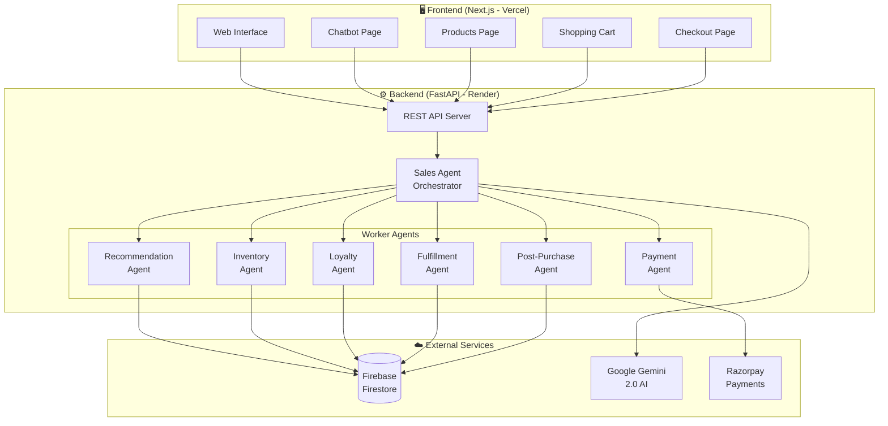
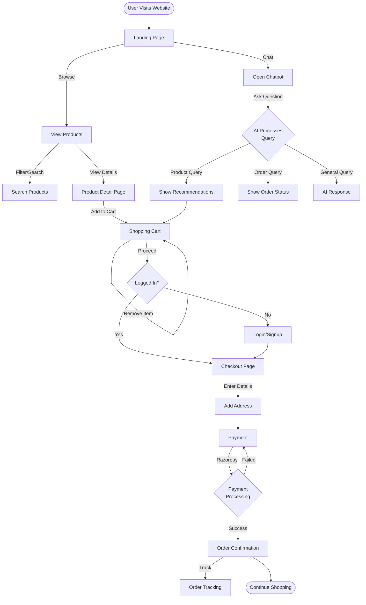
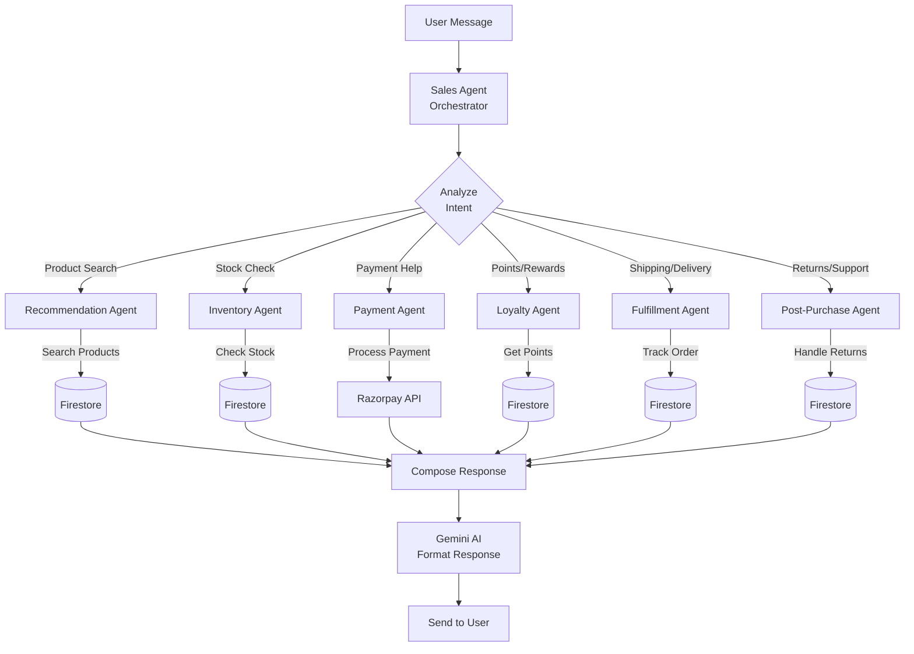
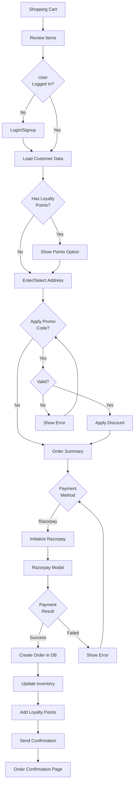
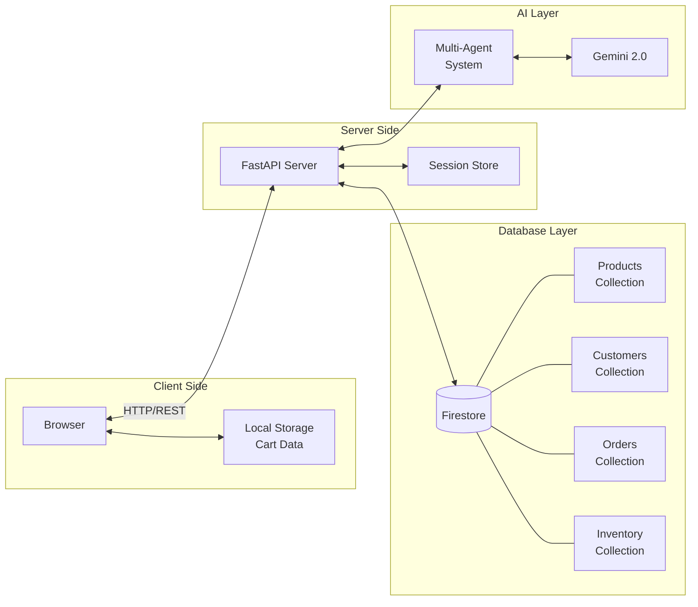
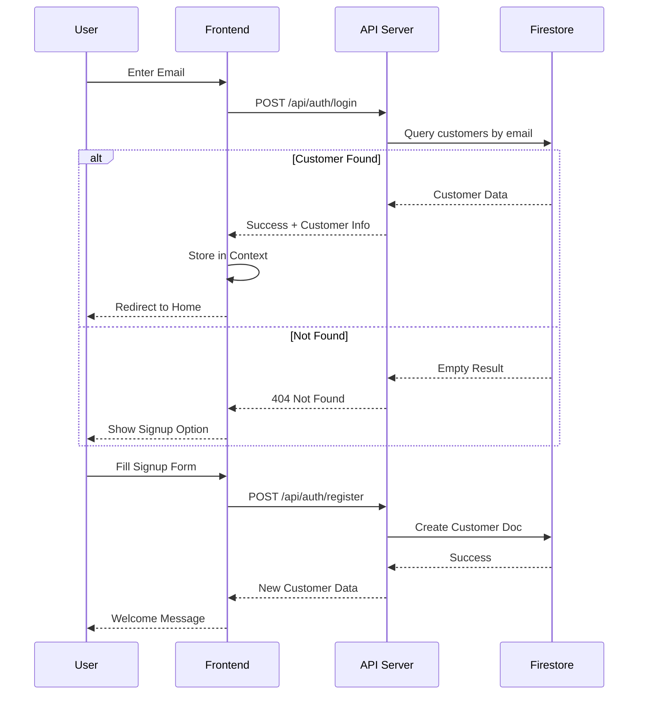
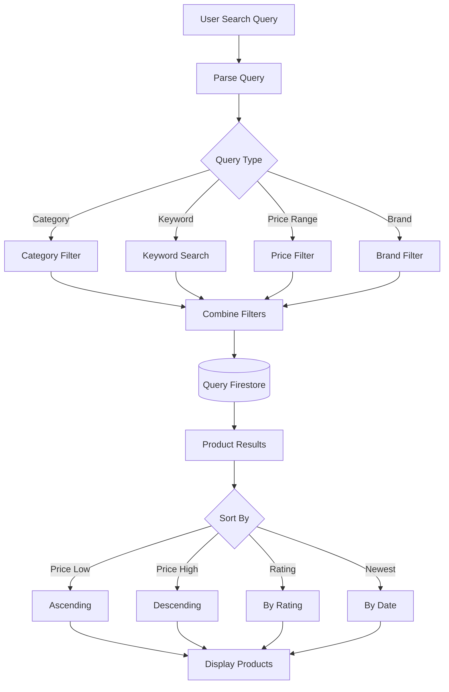
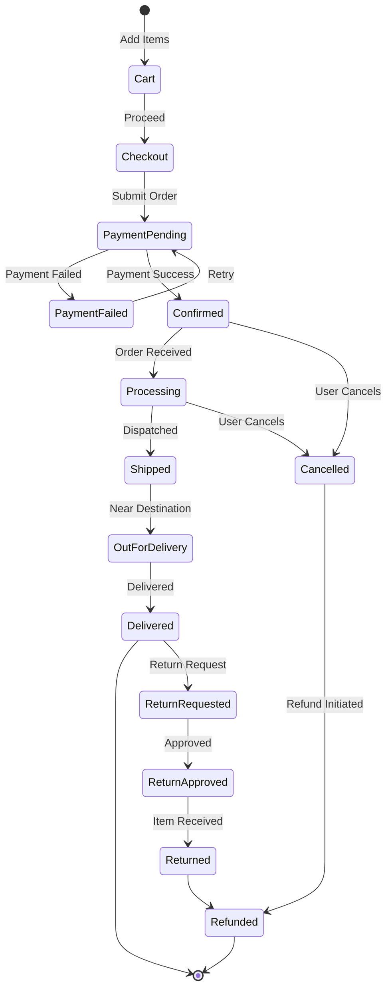
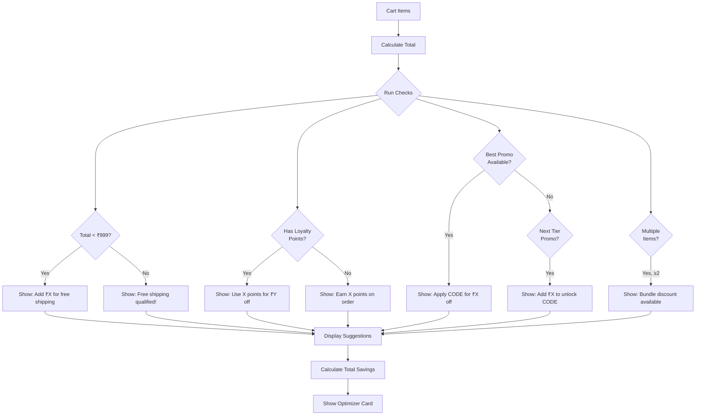
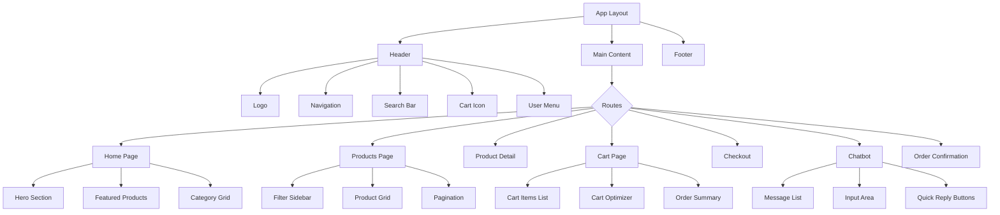

# 📊 System Flowcharts - Retail Sales Agent

## 1. High-Level System Architecture

---

## 2. User Journey Flowchart

---

## 3. AI Agent Workflow

---

## 4. Checkout Flow

---

## 5. Data Flow Diagram

---

## 6. Authentication Flow

---

## 7. Product Search Flow

---

## 8. Order Lifecycle

---

## 9. Cart Optimizer Logic

---

## 10. Component Hierarchy

---

## How to View These Diagrams

1. **GitHub**: Push to GitHub - diagrams render automatically
2. **VS Code**: Install "Markdown Preview Mermaid Support" extension
3. **Online**: Use [mermaid.live](https://mermaid.live) to edit/export

---

*Generated for Retail Sales Agent Project*
